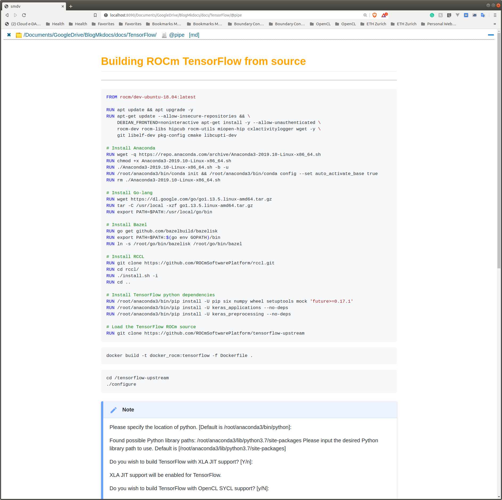

# smdv
a **s**imple **m**ark**d**own **v**iewer for linux.

## Dependencies

### Required
  - `python3` pointing to Python 3.6+.
  - [Pandoc](http://pandoc.org/) [`pip3 install pandoc` | `apt install pandoc` | `pacman -S pandoc` | ... ]
  - [Flask](http://flask.pocoo.org/) [`pip3 install flask` | `apt install python3-flask` | `pacman -S python-flask` | ... ]

### Optional
  - [Neovim Remote](https://github.com/mhinz/neovim-remote) [`pip3 install neovim neovim-remote`]
  - [Jupyter](http://jupyter.org) (to view jupyter notebooks) [`pip3 install jupyter` | `apt install jupyter` | `pacman -S jupyter` | ... ]

## Installation
```
    pip3 install smdv
```

## Compatibility with neovim
This viewer was made with neovim compatibility in mind. With the use of `neovim-remote`,
this script is able to open files in the current neovim window (or spawn a new neovim
window if there is no window available).

However, to make it fully compatible with neovim and to make neovim able to sync
its current file to the viewer, [neovim-remote](https://github.com/mhinz/neovim-remote)
should be installed and the following lines should be added to your `init.vim`:

```
    " start smdv with <F5> from inside neovim using the current neovim server to sync to
    autocmd FileType markdown nnoremap <F5> :w<CR>:silent execute '!killall smdv; smdv % -v "'.v:servername'" &> /dev/null & disown'<CR>

    " sync the current markdown file to smdv on save.
    autocmd BufWritePost *.md silent !smdv --sync %<CR>
```

This (re)starts the viewer when pressing `<F5>` and will sync the state after every save.

## Compatibility with vim-instant-markdown
smdv can be setup as an alternative mini-server for the
[vim-instant-markdown](https://github.com/suan/vim-instant-markdown) plugin for
vim. Install the plugin and add the following line to your vimrc:
```
let g:instant_markdown_python = 1
```


## Screenshots
### markdown preview

### directory


